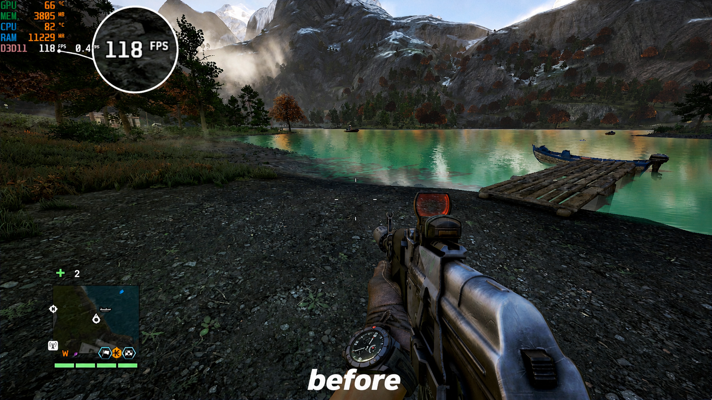
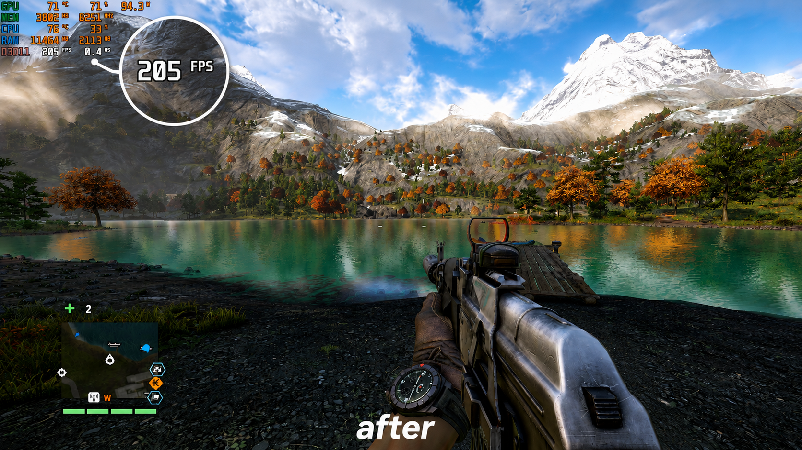

# Far Cry 4 Fps Fix Mod

A complete fps enhancement mod for **Far Cry 4** that fixes the fps drop issue for modern systems, easy-to-install mod.

---

## Before / After

[](https://youtu.be/vZfe1422wrM) — **Before**

[](https://youtu.be/5c7NeJk0m_I) — **After**

*(Click either image to watch gameplay footage)*

---

## What's Included

### 🚀 Performance / FPS Fix

Far Cry 4 was built in 2014 around 4-core CPUs, so it schedules poorly on modern many-core systems, causing stutters and FPS drops. This mod fixes that at the Windows scheduling level, without touching any game files.

- **CPU-aware affinity** — the optimizer detects your CPU vendor automatically and pins Far Cry 4 to 4 physical cores, matching how the game's engine was designed to run:
  - **Intel CPUs:** cores 0, 2, 4, 6
  - **AMD CPUs:** cores 2, 4, 6, 8

  This is the same idea as manually setting "Affinity" for a process in Task Manager — it just does it for you automatically, tuned to your specific CPU.
- **High process priority** — gives Far Cry 4 more CPU time over background apps.
- **Thread priority boost** — bumps every thread in the game process to Highest, tightening frame timing.
- **1ms timer resolution** — Windows' default 15.6ms timer makes the game loop wake up late; dropping to 1ms smooths out frame pacing.
- **GPU process boost** — boosts NVIDIA/AMD/Intel helper processes to reduce stalls during texture streaming.
- **Disabled fullscreen optimizations** — removes the extra input/frame latency Windows adds by wrapping fullscreen DX11 games in a borderless overlay.
- **Optional memory cleanup** — periodically trims the game's working set; useful on 8GB systems, off by default.
- **Fully reversible** — every change is undone automatically the moment you quit the game. Nothing is left behind.
- **No more achievement bug** — earlier versions of this FPS fix could break achievements. That issue is fixed: the game is always launched normally through Steam / Ubisoft Connect / Epic, and the optimizer only tunes it from the outside afterward.

---

## Requirements

- Windows 10 or Windows 11
- PowerShell 5.1 or later (included with Windows by default)
- Far Cry 4, installed via Steam, Ubisoft Connect, or Epic Games

---

## Installation

See **[INSTALL.md](INSTALL.md)** for full, step-by-step setup instructions — including a beginner-friendly walkthrough for Steam, Ubisoft Connect, and Epic Games.

---

## File Structure

```
Far Cry 4/                      <- drop everything here
|-- config/
|   |-- settings.json           <- tweak options here
|-- launcher/
|   |-- process.ps1             <- main optimizer script
|-- SteamLauncher.bat           <- used for the Steam launch option
|-- UbisoftLauncher.bat         <- one-click launcher for Ubisoft Connect
|-- gameProcess.bat             <- manual/Epic Games launch method
```

---

## Configuration

Open `config/settings.json` to adjust behavior:

```json
{
  "ProcessName": "farcry4",
  "Priority": "High",
  "UseSmartAffinity": true,
  "BoostThreadPriority": true,
  "BoostGpuProcesses": true,
  "DisableFullscreenOptimize": true,
  "EnableTimerResolution": true,
  "ChangePowerPlan": false,
  "EnableMemoryCleanup": false,
  "MemoryCleanupIntervalSeconds": 120,
  "LogToFile": true
}
```

| Setting | Default | Description |
|---|---|---|
| `Priority` | `High` | Process priority. Use `High`. Never use `RealTime` — it can freeze your PC. |
| `UseSmartAffinity` | `true` | Automatically detects Intel vs AMD and pins the game to the matching 4-core profile (Intel: 0/2/4/6, AMD: 2/4/6/8). |
| `BoostThreadPriority` | `true` | Boosts all game threads to Highest within the High priority class. |
| `BoostGpuProcesses` | `true` | Boosts NVIDIA/AMD/Intel GPU helper process priorities. |
| `DisableFullscreenOptimize` | `true` | Disables Windows fullscreen optimizations for lower frame latency. |
| `EnableTimerResolution` | `true` | Sets the system timer to 1ms for smoother frame pacing. |
| `ChangePowerPlan` | `false` | Switches to the High Performance power plan while the game runs. Enable if your CPU clocks down during gameplay. Requires admin. |
| `EnableMemoryCleanup` | `false` | Periodically trims RAM. Recommended on 8GB systems. |
| `MemoryCleanupIntervalSeconds` | `120` | How often to trim memory (seconds). |
| `LogToFile` | `true` | Writes `optimizer.log` in the game folder so you can verify what ran. |

---

## How It Works

The mod does **not** launch the game itself. Steam, Ubisoft Connect, or Epic Games always launch Far Cry 4 through their own normal process — that's what keeps achievements working. The optimizer starts in the background, waits until it detects the running `farcry4.exe` process, then applies its settings from the outside. Everything is reversed automatically when you quit the game.

---

## FAQ

**Will this break my achievements?**
No. The game is always launched normally through Steam, Ubisoft Connect, or Epic Games. The optimizer only adjusts Windows process settings from the outside — equivalent to manually changing priority/affinity in Task Manager. This was a known issue in older FPS-fix mods; it's fixed here.


**My CPU has more than 4 cores — will affinity hurt performance?**
No. Far Cry 4's Dunia Engine 2 was designed for 4 physical cores and doesn't scale past that. Giving it more cores adds inter-core synchronization overhead rather than more performance. Pinning it to 4 fast cores gives it what it was built for.

**Can I use the optimizer on other games?**
`ProcessName` in `settings.json` can be changed to any process name, and the scheduling optimizations apply generically. Results will vary by engine. (The weapon/visual/bug fixes are Far Cry 4-specific.)

---

## Disclaimer

This is a fan-made modification intended to improve the Far Cry 4 experience while staying faithful to the original game. It is not affiliated with or endorsed by Ubisoft.
